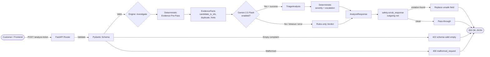
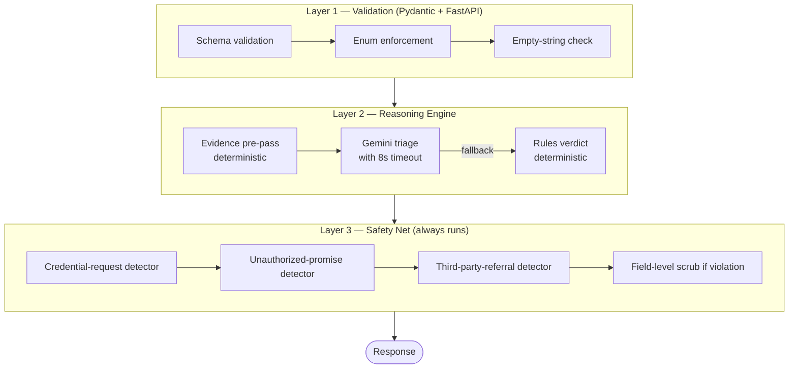
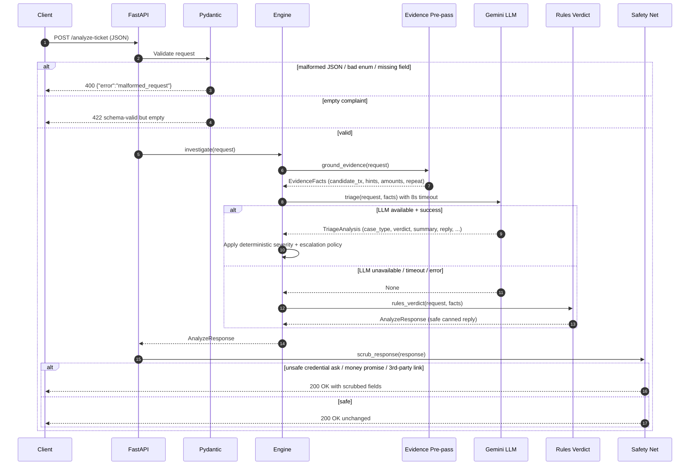
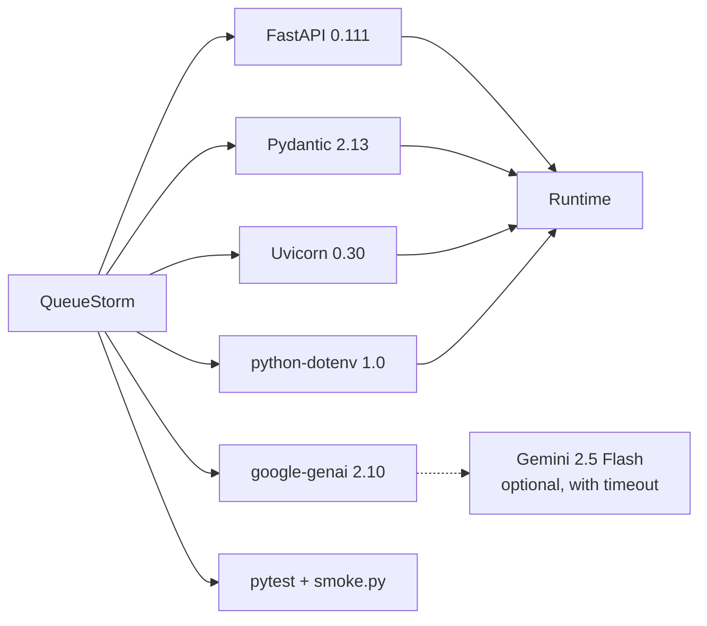
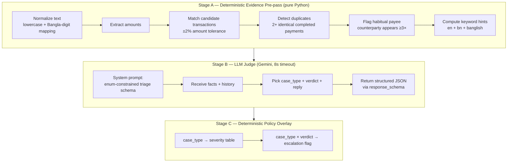
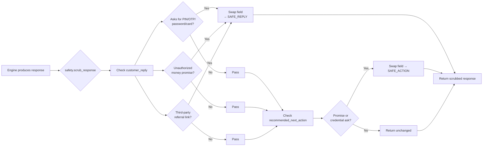
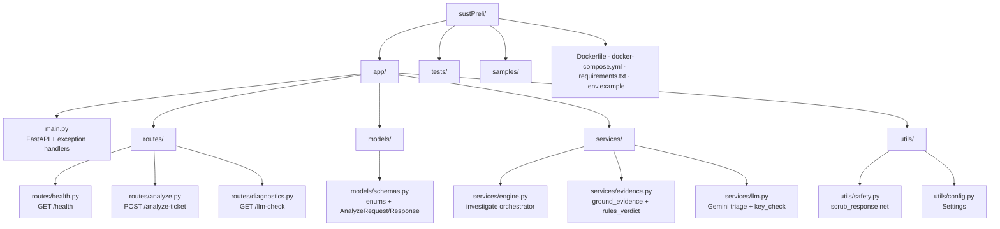

# QueueStorm Investigator

> **A fintech support-copilot API that doesn't just read complaints — it investigates them.**
> Built for the **SUST CSE Carnival 2026 — Codex Community Hackathon (Preliminary)**.
>
> *Not a classifier. An investigator. The verdict is grounded in transaction evidence, not just text.*

[](#)
[](#)
[](#)
[](#)

---

## Table of Contents
- [Why QueueStorm?](#why-queuestorm)
- [What Makes It Special](#what-makes-it-special)
- [Architecture Overview](#architecture-overview)
- [Request Lifecycle](#request-lifecycle)
- [Tech Stack](#tech-stack)
- [Quick Start (TL;DR — 60 seconds)](#quick-start-tldr--60-seconds)
- [Detailed Installation](#detailed-installation)
  - [Option A — Run with Python (easiest)](#option-a--run-with-python-easiest)
  - [Option B — Run with Docker (recommended for judges)](#option-b--run-with-docker-recommended-for-judges)
  - [Option C — Run with Docker Compose](#option-c--run-with-docker-compose)
- [Configuration](#configuration)
- [API Endpoints](#api-endpoints)
- [Sample Request & Response](#sample-request--response)
- [How the Hybrid Reasoning Engine Works](#how-the-hybrid-reasoning-engine-works)
- [Safety Logic (The Last-Line Net)](#safety-logic-the-last-line-net)
- [Testing](#testing)
- [Deployment](#deployment)
- [Project Structure](#project-structure)
- [Limitations & Roadmap](#limitations--roadmap)

---

## Why QueueStorm?

Fintech support tickets are a **storm of ambiguity**. A customer writes *"amar taka transfer hoy nai kintu kete nise"* (Banglish: *"money didn't transfer but got deducted"*) — and the agent has to decide:

- Did it really fail, or did the customer misread a pending hold?
- Is this a phishing attempt masked as a complaint?
- Was the same amount charged twice (duplicate)?
- Does the transaction history actually support what they're claiming?

A naive LLM can hallucinate a transaction id. A naive rule engine can't read Bangla. **QueueStorm combines both**: deterministic rules ground the facts, an LLM judges the nuance, and a safety net guarantees the response is never unsafe.

---

## What Makes It Special

| Pillar | What we do | Why judges care |
|---|---|---|
| **Evidence-grounded reasoning** | The LLM receives *computed facts* (candidate transactions, duplicate suspicion, habitual-payee flag) — not just raw text. | Hallucinated transaction ids are caught before they reach the response. (35% of score) |
| **Hybrid architecture** | Rules handle classification & policy deterministically; Gemini handles language & nuance. | Failover: if the key is missing or Gemini times out, rules answer correctly. |
| **Safety-first** | Two layers: prompt-level constraints **and** an outgoing regex net that scrubs credential asks, money promises, and 3rd-party referrals. | Rubric penalties up to −35 points; 2+ critical violations = disqualified. |
| **Multilingual native** | Keyword tables in English + Bangla + Banglish; the LLM mirrors the customer's language in the reply. | Realistic for Bangladesh fintech. |
| **Stateless & deployable** | No DB. Docker image <500 MB. /health answers in <60 s. Runs anywhere. | Matches every hard constraint in the manual. |
| **Never crashes** | Exception handlers guarantee any input — malformed JSON, empty body, garbage — yields a controlled response, never a stack trace. | Reliability is a scored dimension. |

---

## Architecture Overview



### Three-Layer Hybrid Design



---

## Request Lifecycle



---

## Tech Stack



- **Backend:** FastAPI + Pydantic (strict enum enforcement)
- **Reasoning:** Gemini 2.5 Flash (`response_schema` + `thinking_budget=0`) — guarded by an 8-second worker-thread timeout
- **Deterministic engine:** Pure-Python rules; zero I/O; never raises
- **Safety:** `re` (stdlib) — outgoing scrub net
- **Container:** `python:3.11-slim`, non-root user, multi-stage `<500 MB`
- **Tests:** pytest + a manual `smoke.py` that hits a running server

---

## Quick Start (TL;DR — 60 seconds)

```bash
git clone <your-repo-url> sustPreli && cd sustPreli
docker build -t queuestorm . && docker run -p 8000:8000 queuestorm
curl http://localhost:8000/health
```

That's it. (See below if you want to go deeper.)

---

## Detailed Installation

> *So easy a child could do it.* Every step is spelled out. Pick the option that matches your comfort level.

### Prerequisites

You need **one** of these:
- **Python 3.11+** installed locally, **or**
- **Docker Desktop** (or `docker` + `docker compose` on Linux)

Optional for the LLM features: a **Google Gemini API key** (free tier is fine). Without it, the engine still works using the deterministic rules engine.

---

### Option A — Run with Python (easiest)

**Step 1.** Open a terminal in the project folder.
```bash
cd /path/to/sustPreli
```

**Step 2.** Create a virtual environment (so Python packages don't pollute your system).
```bash
python3 -m venv .venv
```

**Step 3.** Activate it.
```bash
# macOS / Linux:
source .venv/bin/activate

# Windows (PowerShell):
.venv\Scripts\Activate.ps1

# Windows (cmd):
.venv\Scripts\activate.bat
```
You should now see `(.venv)` at the start of your terminal prompt.

**Step 4.** Install the dependencies.
```bash
pip install --upgrade pip
pip install -r requirements.txt
```

**Step 5.** (Optional) Configure secrets.
```bash
cp .env.example .env
# Open .env in any editor and paste your GEMINI_API_KEY if you have one.
```

**Step 6.** Start the server.
```bash
uvicorn app.main:app --host 0.0.0.0 --port 8000
```

**Step 7.** Verify it works.
```bash
curl http://localhost:8000/health
# Expected: {"status":"ok"}
```

🎉 Done. Open `http://localhost:8000/docs` for the interactive Swagger UI.

---

### Option B — Run with Docker (recommended for judges)

This is the cleanest, most reproducible path. **No Python needed.**

**Step 1.** Make sure Docker is running:
```bash
docker --version
```

**Step 2.** Build the image:
```bash
docker build -t queuestorm .
```
*(First build takes ~30 seconds; subsequent builds use cache.)*

**Step 3.** Run it (rules-only — no API key required):
```bash
docker run --rm -p 8000:8000 queuestorm
```

**Step 4 (optional).** Run with a Gemini key:
```bash
# Create a file called judging.env (or any name) with:
echo "GEMINI_API_KEY=your_real_key_here" > judging.env

docker run --rm -p 8000:8000 --env-file judging.env queuestorm
```

**Step 5.** Verify:
```bash
curl http://localhost:8000/health
# Expected: {"status":"ok"}
```

🎉 Done. The image is `<500 MB` and starts in under 60 seconds.

---

### Option C — Run with Docker Compose

If you prefer `docker compose` (one command, no manual build step):

**Step 1.** Create your `.env` file:
```bash
cp .env.example .env
# (optional) edit .env to paste your GEMINI_API_KEY
```

**Step 2.** Bring it up:
```bash
docker compose up --build
```

**Step 3.** Stop it:
```bash
docker compose down
```

The compose file includes a built-in healthcheck — Docker will mark the container as `healthy` only when `/health` returns 200.

---

## Configuration

All configuration is read from environment variables at startup. **Never commit secrets.** The `.env` file is gitignored.

| Variable | Default | Purpose |
|---|---|---|
| `PORT` | `8000` | HTTP port the server binds to. |
| `API_KEY` | _(empty)_ | Reserved for upstream auth (not enforced yet). |
| `GEMINI_API_KEY` | _(empty)_ | If absent, the engine runs in rules-only mode. |
| `GEMINI_MODEL` | `gemini-2.5-flash` | Model id passed to the Gemini SDK. |
| `LLM_TIMEOUT_S` | `8` | Hard cap on each LLM call (worker-thread timeout). |
| `LLM_TEMPERATURE` | `0` | Sampling temperature for the judge. |

> **Tip for judges:** If you don't have a Gemini key, just run with the defaults. The rules engine will answer every request correctly and safely — the LLM is a quality enhancement, not a requirement.

---

## API Endpoints

### `GET /health`
Liveness probe. Always returns `{"status":"ok"}` once the app is up.

### `POST /analyze-ticket`
The main investigation endpoint. JSON in, JSON out.

**Request body (schema):**
```json
{
  "ticket_id": "string (required)",
  "complaint": "string (required, non-empty)",
  "language": "en | bn | mixed (optional)",
  "channel": "in_app_chat | call_center | email | merchant_portal | field_agent (optional)",
  "user_type": "customer | merchant | agent | unknown (optional)",
  "campaign_context": "string (optional)",
  "transaction_history": [
    {
      "transaction_id": "TX1",
      "timestamp": "ISO-8601 string",
      "type": "transfer | payment | cash_in | cash_out | settlement | refund",
      "amount": 500.0,
      "counterparty": "01700000000",
      "status": "completed | failed | pending | reversed"
    }
  ],
  "metadata": { "any": "extra context" }
}
```

**HTTP status codes:**

| Code | When | Body |
|---|---|---|
| `200` | Successful investigation | Full `AnalyzeResponse` |
| `400` | Malformed JSON / missing required field / bad enum | `{"error":"malformed_request"}` |
| `422` | Schema-valid but empty complaint | Error detail |
| `500` | Unexpected internal error | `{"error":"internal_error"}` (no stack/secret leak) |

### `GET /llm-check` *(diagnostic, not scored)*
Returns whether the Gemini key is present and reachable — **never leaks the key**. Useful for sanity-checking your environment before submission.

---

## Sample Request & Response

**Request:**
```bash
curl -X POST http://localhost:8000/analyze-ticket \
  -H "Content-Type: application/json" \
  -d '{
    "ticket_id": "T1",
    "complaint": "amar taka transfer hoy nai kintu kete nise",
    "transaction_history": [
      {
        "transaction_id": "TX1",
        "timestamp": "2026-01-01T10:00:00Z",
        "type": "transfer",
        "amount": 500,
        "counterparty": "01700000000",
        "status": "failed"
      }
    ]
  }'
```

**Response:**
```json
{
  "ticket_id": "T1",
  "relevant_transaction_id": "TX1",
  "evidence_verdict": "consistent",
  "case_type": "payment_failed",
  "severity": "high",
  "department": "payments_ops",
  "agent_summary": "Auto-triaged as payment_failed from the complaint and transaction history.",
  "recommended_next_action": "Route to the responsible team for review through official channels.",
  "customer_reply": "Thank you for reporting this. We have logged your concern and our team will review it through official support channels. Please keep your account credentials private.",
  "human_review_required": true,
  "confidence": 0.92,
  "reason_codes": ["payment_failed", "transaction_match"]
}
```

---

## How the Hybrid Reasoning Engine Works



**Key insight:** the LLM is *not* asked to invent facts — it receives a pre-computed summary (`grounded_facts`) and only chooses classification, verdict, summary text, and a customer-facing reply in the user's language. **Hallucination is bounded.**

If the LLM is unavailable (no key, timeout, any exception), the rules verdict produces a safe, schema-correct response with a canned reply and `human_review_required=true` for non-trivial cases. **No request is ever dropped or delayed past the budget.**

---

## Safety Logic (The Last-Line Net)



**Three categories of violation, three pre-canned safe replacements:**

| Violation | Detector pattern | Replacement |
|---|---|---|
| **Credential request** | Request verb within 40 chars of `PIN/OTP/password/CVV/card number` | `Thank you for reaching out. We have logged your concern… Please keep your account credentials private…` |
| **Unauthorized money promise** | `we will refund`, `we have reversed`, `unblocked`, `restored`, etc. | `Any eligible amount will be returned through official channels.` |
| **Third-party referral** | `WhatsApp`, `Telegram`, `t.me`, `bit.ly`, `click this link`, etc. | Field swapped to safe text. |

> The net **runs on outgoing responses, after the engine**. Even if the LLM somehow emits unsafe text, it never reaches the customer. Safe responses pass through unchanged (no false positives in normal warnings like *"never share your PIN"*).

---

## Testing

### Unit / integration tests (pytest)
```bash
pip install -r requirements-dev.txt
pytest -q
```

### Smoke test (against a running server)
```bash
# Local:
python smoke.py

# Remote (after deploy):
python smoke.py online
```

Smoke covers: `/health` 200, valid ticket 200, missing complaint 400, empty complaint 422, bad JSON 400.

### Compare LLM vs rules
```bash
python run_samples_live.py        # hits the live endpoint with sample cases
python compare_responses_live.py  # diffs LLM vs rules-only answers
```

---

## Deployment

Two paths are both supported:

### 1. Live URL (Render, Railway, Fly.io, etc.)
- The `Dockerfile` honors `$PORT` at runtime.
- Bind `0.0.0.0` (already configured in `CMD`).
- Set `GEMINI_API_KEY` (optional) in the platform's env-var UI.
- The `/health` endpoint is the platform's health-check target.

### 2. Docker image
```bash
docker build -t queuestorm:latest .
# Image size is <500 MB (uses python:3.11-slim, no GPU, no large weights).
docker run --rm -p 8000:8000 --env-file judging.env queuestorm
```

**No real customer data. No committed secrets. `.env` is gitignored.**

---

## Project Structure



---

## Limitations & Roadmap

| Today | Tomorrow |
|---|---|
| Reasoning engine = deterministic safe default + Gemini fallback | Add learned scoring (time-decay match, fuzzy amounts, scam-pattern detection) |
| Safety net = regex proximity (verb-before-token), not primary guard | Train a small classifier for *bare* credential asks that slip past the regex |
| Timestamps stored as strings, compared not parsed | Parse to datetime for stricter duplicate / staleness detection |
| No persistence; all state in-process | Optional Redis cache for repeated tickets (cost & latency win) |

**Known footguns (documented for the next iteration):**
- A bare *"your OTP is needed"* (no request verb) may slip past the net — covered by the engine's escalate-when-unsure default.
- Habitual-payee detection uses `>=3` transfers; tune once real-data distributions are known.

---

## License & Credits

Built for the **SUST CSE Carnival 2026 — Codex Community Hackathon (Preliminary)** by Team *Rocher d'Ephyra*.